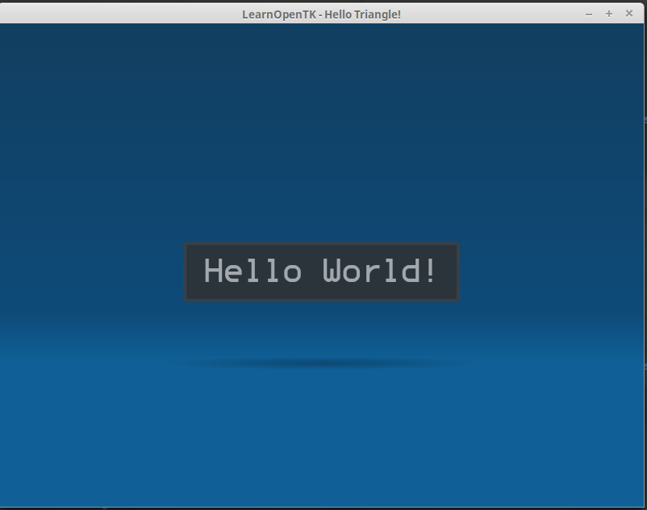

# OpenTK / Noesis GUI .NET Core example.

This repository contains a minimal example of Noesis GUI used with OpenTK. This examples runs on .NET core. I've only tested this with Linux, but I assume this will work on other platforms as well. The code is based on [IntegrationGLUT NoesisGUI example](https://github.com/Noesis/Tutorials/tree/master/Samples/IntegrationGLUT), with some slight modifications from the [Hello Triangle example from OpenTK](https://github.com/opentk/LearnOpenTK/tree/master/Chapter1/2-HelloTriangle).

